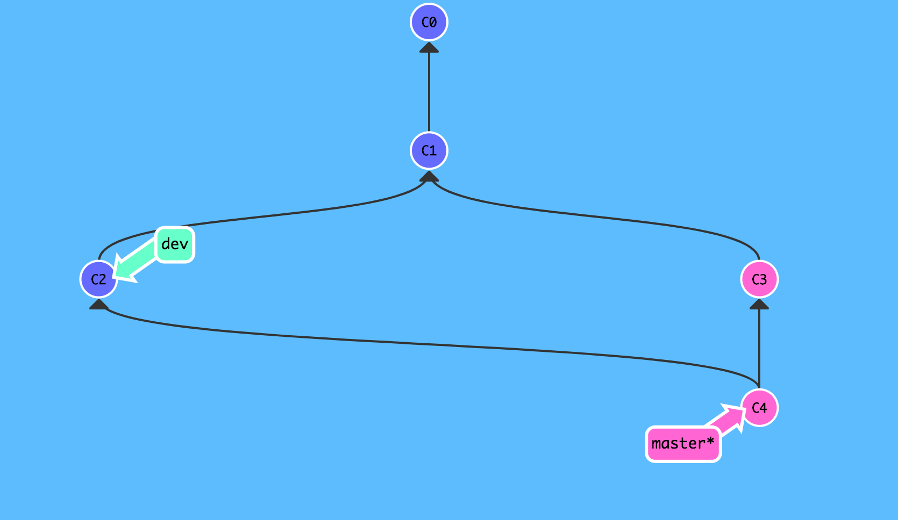
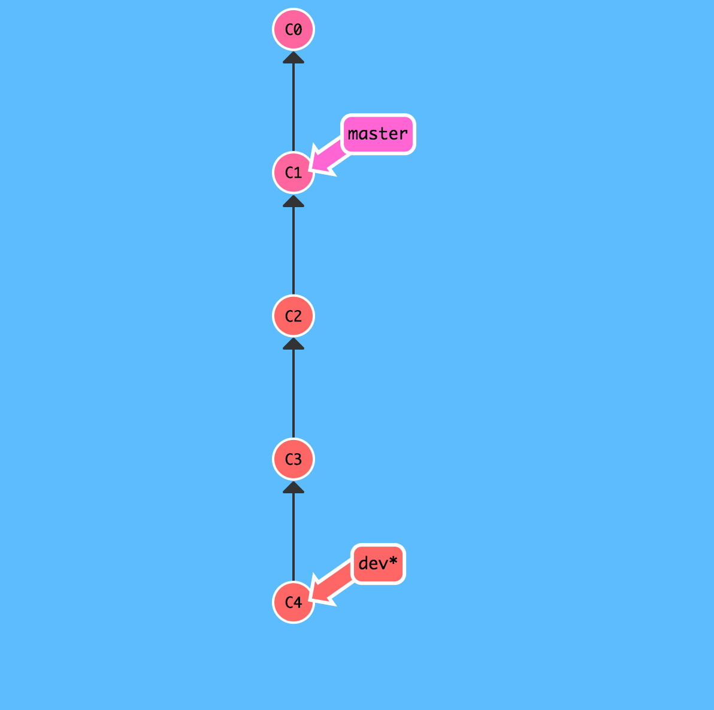

最近发现git log中有很多无用信息，分支也比较繁琐。所以在想有没有什么指令可以让commit记录看起来清晰明了，经过学习发现git rebase可以解决此问题。

在深入了解git rebase之前，先回顾一下常用的一些指令。

## 常用指令

仓库初始化

```bash
git init
```

克隆远程仓库

```bash
git clone
```

添加上游仓库

```bash
git remote add
```

分支的创建、删除、切换和合并

```bash
git branch
git branch -d
git checkout
git merge
```

修改文件添加到本地仓库

```bash
git add
git commit
```

拉取远程更新

```bash
git fetch
```

本地仓库的更新和上传

```bash
git pull
git push
```

分支提交历史和状态

```bash
git log
git status
```

分支回滚

```bash
git revert
git reset
```

## git rebase详解

git rebase主要可以解决以下问题：

1. 合并分支
2. 合并多次commit记录

### 合并分支

假设我们目前有`master`和`dev`两个分支，其中master和dev分支上各有一次提交，状态如下：


此时如果需要将dev上的分支内容合并到master，我们一般会进行如下操作：

```bash
git merge dev
```

合并之后状态如下：



此时执行`git log`，日志如下：

```bash
700c335 (HEAD -> master) Merge branch 'dev'
3c439fa add t2
ec8e71c (dev) add t1
00dbbcd change message
e61090f add index.js
```

我们会看到虽然成功合并了，但产生了一次新的commit提交，这个commit是自动生成的，那么有没有办法避免掉这次新提交，这是有`git rebase`就派上用场了。

执行以下操作：

```bash
git rebase master dev
```

此时状态如下：


执行git log，日志如下：

```bash
b11f2fb (HEAD -> dev) add t1
64e3df4 (master) add t2
00dbbcd change message
e61090f add index.js
```

可见commit记录非常清晰。

### 合并多次commit记录

有时候我们开发一个功能可能需要多次commit，当合并到master分支后，这些commit记录也会全部存在，那么有没有办法整理这些commit，使其变成一次commit，这样也方便以后的代码review。

首先在没使用git rebase之前，假设dev上有三次提交，状态如下：



接下来我们尝试合并这些commit：

```bash
git rebase -i HEAD~3
```

状态如下：


可见git rebase的commit合并功能十分好用。

### 参考链接

- [Rebase 代替合并](https://www.git-tower.com/learn/git/ebook/cn/command-line/advanced-topics/rebase#start)
- [彻底搞懂 Git-Rebase](http://jartto.wang/2018/12/11/git-rebase/)
