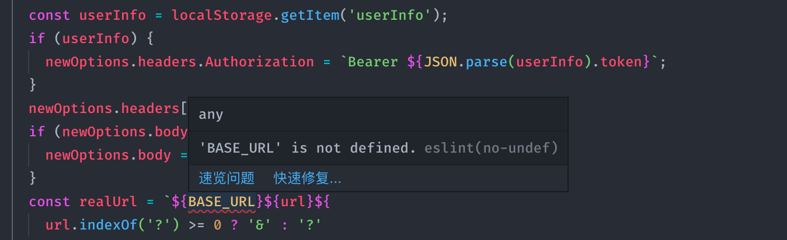

## 起因

项目现在需要在不同的环境下请求不同的API地址，也就是`BASE_URL`不同。本地开发和测试环境就走test上的BASE_URL，正式环境就走prod上的。在之前的项目中都是利用`process.env.NODE_ENV`做区分，但是到了umi这里，发现配置process.env.NODE_ENV并不起作用，经过一番研究才有了此文。

## 解决方案

### 1. 配置config.js

由于项目用的是*Ant Design Pro*这套脚手架，所以项目配置文件是*config.js*。根据umijs官方文档介绍，我们可以利用[define](https://umijs.org/zh/config/#define)来配置我们需要的全局变量。这里我只截取需要配置的部分：

```js
// config.js
...
define: {
  BASE_URL: 'http://test.com',
}
...
```

这样我们就能够在代码中直接使用`BASE_URL`这个变量。目前这个变量是在默认环境下使用的，也就是无论是本地开发，测试环境还是正式环境都是用的这个地址。

如果需要在生产环境使用其他地址，根据[官方文档](https://umijs.org/zh/guide/env-variables.html#umi-env)，我们需要新建一个配置文件。比如我们需要在prod环境下使用其他BASE_URL，那么我们就在当前配置文件所在的目录下新建一个config.prod.js。代码如下：

```javascript
// config.prod.js
export default {
  define: {
    BASE_URL: 'http://prod.com',
  }
};
```

当我们指定项目启动时的环境变量为prod时，*config.prod.js*就会生效，它会覆盖掉默认配置文件*config.js*中的`BASE_URL`变量。接下来我们就需要配置项目启动参数来指定环境变量。

### 2. 配置启动参数

我们要在*package.json*文件中配置我们的启动参数如下：

```json{4}
"scripts": {
  "start": "cross-env MOCK=none umi dev",
  "test": "cross-env umi build",
  "build": "cross-env UMI_ENV=prod umi build"
}
```

因为我们需要本地开发和测试环境打包部署时走测试地址，正式环境打包部署时走正式地址，所以这里我只设置了正式环境打包时的env变量：`UMI_ENV=prod`，这样正式环境就会使用*config.prod.js*中的BASE_URL，本地和测试就用默认的，也就是*config.js*中的BASE_URL。

## 疑问

主要有两个问题：

1. 为什么配置process.env.NODE_ENV不起作用？

    根据官方解释[define中设置process.env.NODE_ENV不起作用](https://github.com/umijs/umi/issues/1757)，process.env.NODE_ENV是写死的，`umi dev`时为*development*，`umi build`时为*production*。

2. 经过上述配置，我们就可以实现不同环境走不同的BASE_URL了，但我们会出现一个问题，那就是当我们在代码中直接使用BASE_URL时会提示变量不存在，开启*Eslint*的情况下会直接报错，但不影响代码正常运行。

    

    如果要解决掉Eslint这个报错提示，我们需要在 *.eslintrc.js* 配置文件中添加`globals`配置：

    ```javascript
    ...
    globals: {
      BASE_URL: true,
    }
    ...
    ```
