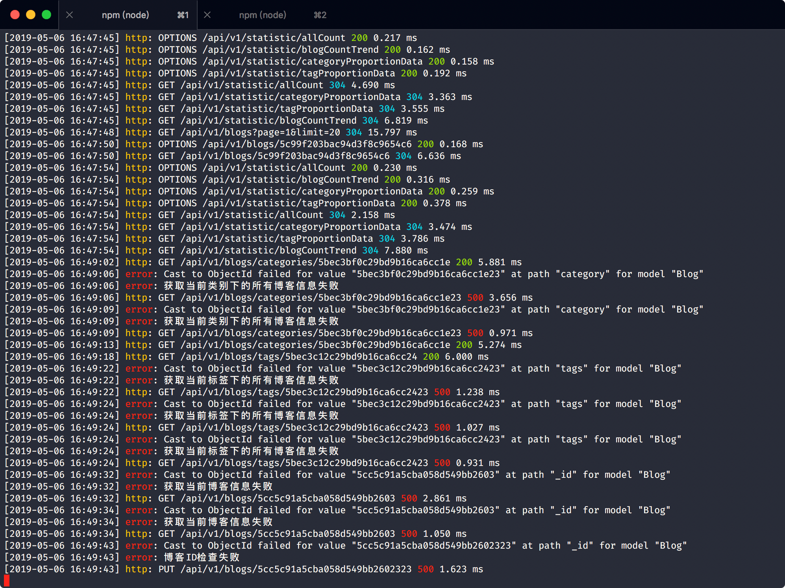

最近忙着做毕业设计，项目是一个多用户博客程序。后端技术栈为express+mongodb，为了能够更为详细的记录程序运行日志，便开始研究如何使用winston和morgan。项目代码已托管到GitHub，感兴趣的同学可以看一下：[PureBlog-API](https://github.com/njzydark/PureBlog-API)

## 效果

可以在终端中显示所需要的日志信息



可以以文件的形式存储日志


## 实现步骤

winston和morgan的详细使用方法大家还是以官方文档为准，我下面只是简要介绍我是如何使用的。

1. 安装winston和morgan

    ```bash
    npm install --save winston morgan
    ```

2. 创建logger

      - 先判断项目根目录是否存在logs文件夹，不存在则创建。
      - 配置日志等级和颜色
      - 配置日志以文件存储是的等级和文件名
      - 自定义日志格式
      - 创建stream用于添加morgan的Http请求日志信息

      代码实现如下：

      ```javascript
      const path = require('path')
      const fs = require('fs')
      const { createLogger, format, transports, addColors } = require('winston')

      // 确保项目根目录存在logs文件夹
      const logDirectory = path.resolve('./', 'logs')
      fs.existsSync(logDirectory) || fs.mkdirSync(logDirectory)

      // 配置等级和颜色
      const config = {
        levels: {
          error: 0,
          debug: 1,
          warn: 2,
          data: 3,
          info: 4,
          verbose: 5,
          silly: 6,
          http: 7
        },
        colors: {
          error: 'red',
          debug: 'blue',
          warn: 'yellow',
          data: 'grey',
          info: 'green',
          verbose: 'cyan',
          silly: 'magenta',
          http: 'yellow'
        }
      }

      // 添加自定义颜色
      addColors(config.colors)

      const options = {
        allLog: {
          level: 'http',
          filename: path.resolve(logDirectory, 'all.log')
        },
        errorLog: {
          level: 'error',
          filename: path.resolve(logDirectory, 'error.log')
        }
      }

      function formatParams(info) {
        let { timestamp, level, message } = info
        message = message.replace(/[\r\n]/g, '')
        return `[${timestamp}] ${level}: ${message}`
      }

      const logger = createLogger({
        level: 'http',
        levels: config.levels,
        handleExceptions: true,
        json: true,
        maxsize: 5242880, // 5MB
        maxFiles: 5,
        format: format.combine(
          format.colorize(),
          format.timestamp({ format: 'YYYY-MM-DD HH:mm:ss' }),
          format.printf(formatParams)
        ),
        transports: [new transports.File(options.allLog), new transports.File(options.errorLog), new transports.Console()]
      })

      // 添加morgan日志信息
      logger.stream = {
        write: function(message, encoding) {
          logger.http(message)
        }
      }

      module.exports = logger

      ```

3. 创建morgan日志处理中间件

    ```javascript
    const morgan = require('morgan')
    const logger = require('../utils/logger')

    // 解决自定义格式时响应时间不着色的问题
    morgan.token(`status`, (req, res) => {
      const status = (typeof res.headersSent !== `boolean`
      ? Boolean(res._header)
      : res.headersSent)
        ? res.statusCode
        : undefined
      // get status color
      const color =
        status >= 500
          ? 31 // red
          : status >= 400
          ? 33 // yellow
          : status >= 300
          ? 36 // cyan
          : status >= 200
          ? 32 // green
          : 0 // no color
      return `\x1b[${color}m${status}\x1b[0m`
    })

    const devModify = ':method :url :status :response-time ms'
    const combinedModify = ':remote-addr :method :url :status :response-time ms :user-agent"'
    const morganFormat = process.env.NODE_ENV == 'development' ? devModify : combinedModify

    module.exports = morgan(morganFormat, { stream: logger.stream })

    ```

4. 使用morgan日志处理中间件

    ```javascript
    const handleLog = require('./middlewares/handleLog')

    app.use(handleLog)
    ```

5. 完成以上步骤，morgan的日志信息便可以显示出来。当我们需要自己的日志时，需要引入logger，并使用logger.info或者logger.error等方法。

    这是我在常规的业务逻辑中记录日志：

    ```javascript
    async getAllTags(req, res, next) {
      try {
        const tags = await Tag.find().exec()
        res.status(200).send({
          success: true,
          data: tags
        })
      } catch (e) {
        logger.error(e.message)
        next(new Error(`获取所有标签信息失败`))
      }
    }
    ```

   这是我在错误处理中间件中统一对错误进行记录：

   ```javascript
   const logger = require('../utils/logger')

   // 错误捕捉
   module.exports = (err, req, res, next) => {
     logger.error(err.message)
     res.status(500).send({
       success: false,
       message: err.message
     })
   }

   ```

## 参考链接

[winston](https://github.com/winstonjs/winston)

[morgan](https://github.com/expressjs/morgan)

[express-combine-morgan-and-winston/](https://jojozhuang.github.io/tutorial/nodejs/express-combine-morgan-and-winston/)
